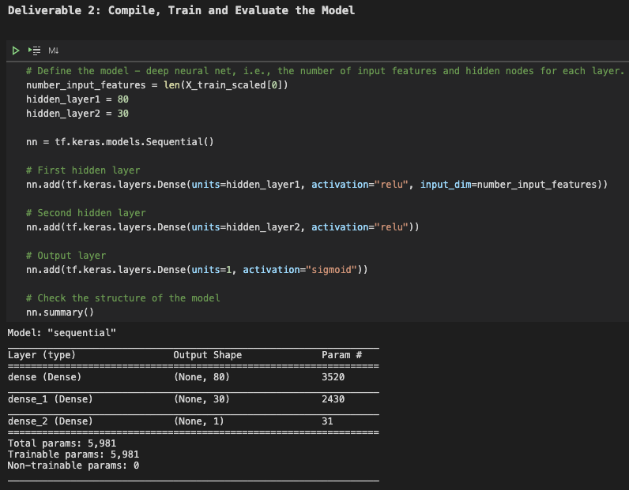
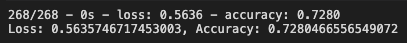
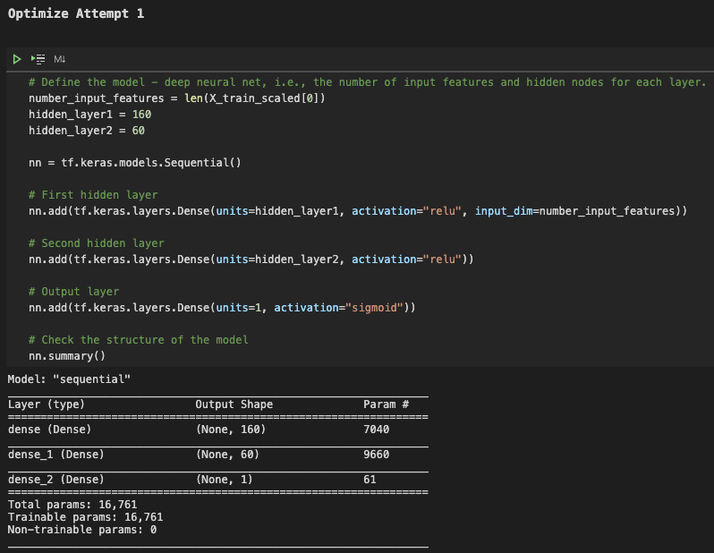
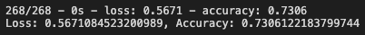
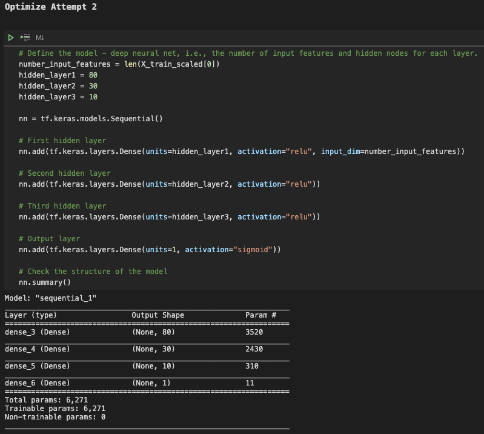
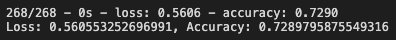
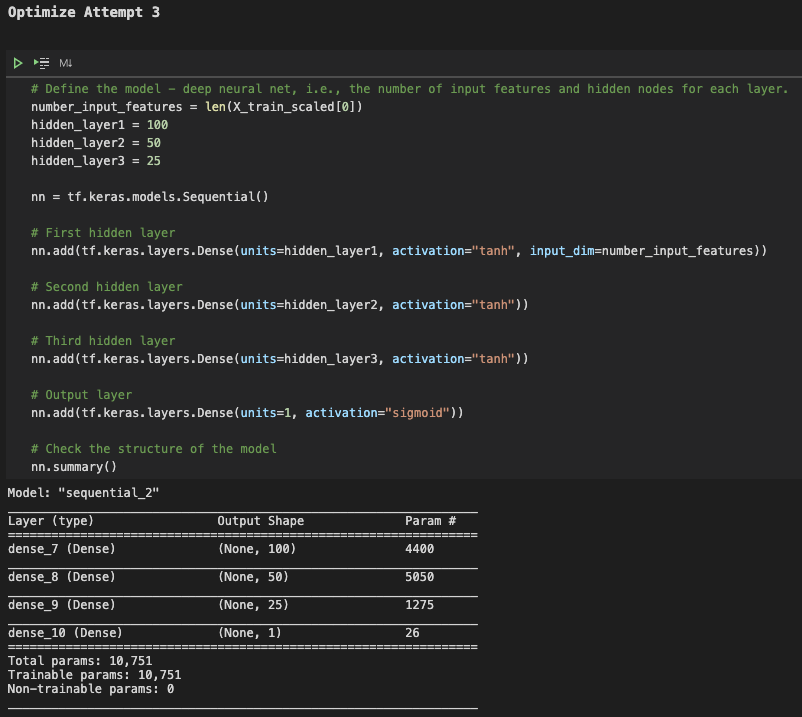
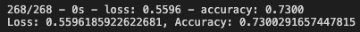

# Neural_Network_Charity_Analysis

## Overview of the Analysis

For this project, I used my knowledge of machine learning and neural networks and used the features in the charity dataset to create a binary classifier that is capable of predicting whether applicants will be successful if funded by Alphabet Soup.  The charity dataset contains over 34,000 organizations that have been funded by Alphabet Soup. There are a number of columns that capture the metadata of each organization such as organization type and the use of funding. This project is encompassed three steps, preprocessing the data for the neural network, compile, train and evaluate the model.  Finally, I optimized the model to have an accuracy equal to or greater then 75%.

## Results

### Data Preprocessing

-	The variable that we are targeting in this model is the IS_SUCCESSFUL field.

-	All fields in the dataset are considered to be features for the model besides fields “EIN” and “NAME” which we dropped from the dataset.

-	The fields we dropped that are neither a target or feature for this analysis are the fields “EIN” and “NAME”.  Both removed fields I expect will have little to do with the outcome.

### Compiling, Training, and Evaluating the Model

-	The initial model that we created had input features and two hidden layers and an output layer.  The first hidden layer had 80 neurons with an activation function “relu”.  The second hidden layer had 30 neurons with an activation function “relu". The output layer used the activation layer of “sigmoid”.

-	The target accuracy percentage for the model was 75% and the initial model recorded an accuracy percentage of ~72%, just short of our target percentage.

-	In order to increase our accuracy percentage of the model to be greater than 75%, I tried a couple different modifications to the model in hopes to increase the model’s performance.

#### Attempt 1

For my first attempt at improving the model’s performance, I doubled the number of neurons in the first hidden layer from 80 neurons to 160 neurons and doubled the number of neurons in the second layer from 30 to 60 neurons.  This modification resulted in an accuracy percentage of ~73%.

#### Attempt 2

For my second attempt at improving the model’s performance, I used the same amount of neurons as in the used in the initial attempt (80 neurons in the first hidden layer and 30 neurons in the second hidden layer) but then added a third hidden layer that contained 10 neurons.  This modification resulted in an accuracy percentage of ~73%.

#### Attempt 3

For my third attempt at improving the model’s performance, I again used three hidden layers but increased the number of neurons in each hidden layer (100 for the first hidden layer, 50 for the second hidden layer and 25 for the thirst hidden layer).  Then I changed the activation function from “relu” to “tanh” for all thirst hidden layers.  This modification resulted in an accuracy percentage of ~73%.

### Results Summary

-	Although I was unable to achieve the target model performance of 75% after three attempts, I was able to slightly increase the model’s accuracy performance from the initial attempt to ~73%.

-	Steps that I took to increase the model’s accuracy performance included adding neurons to hidden layers, adding more hidden layers to the model and using different activation functions within the hidden layers.

## Project Summary

My most successful optimized model had an accuracy of ~73% which was slightly better than our initial attempt. We started with a dataset and tried to predict whether or not the charity project would be successful on all of the features that we used after dropping two features that were irrelevant. Although I did not get to the accuracy of 75%, I believe we could have achieved an accuracy above 75% if we were persistent and kept trying different combinations of number of neurons used, number of hidden layers used and different activation functions on our model.  I also believe we could have increased the accuracy of our model well above 75% if we had a dataset with more records and by using the Gaussian Error Linear Unit (GELU) as our activation function on the hidden layers.  This would allow our neural network model to have more opportunity to learn and increase the overall performance.
